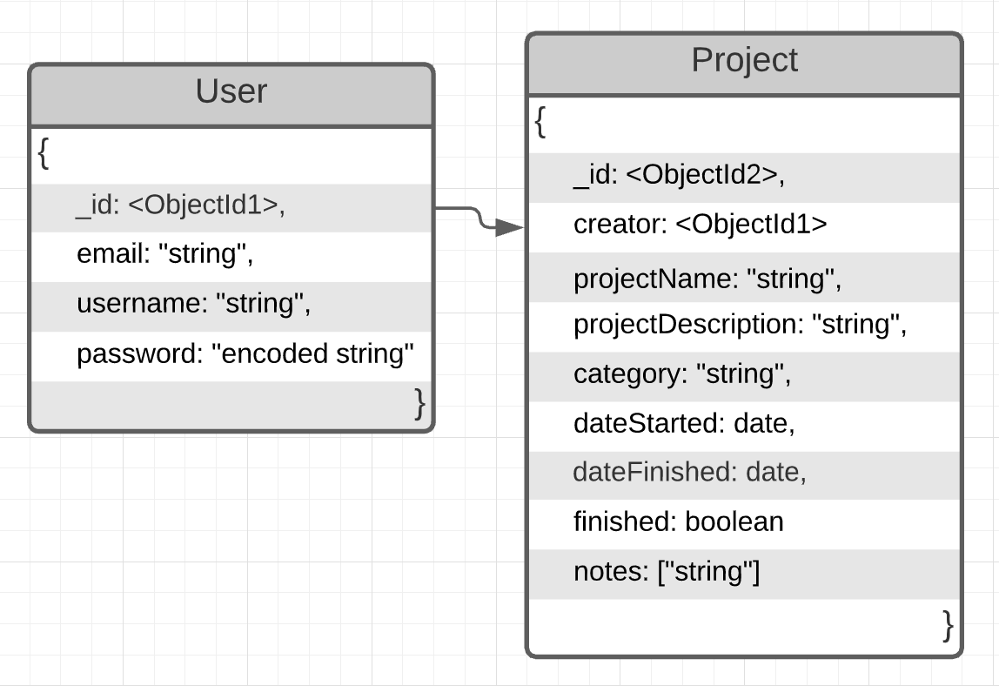

# ProjectManagmentBackEnd


[](https://github.com/tterb/atomic-design-ui/blob/master/LICENSEs)

This is a backend server for a project management application. User's will be able to sign up for an account, add projects that they are currently working on with added notes about the project.

## **Author:** Adrian Huebner [](https://www.linkedin.com/in/adrianhuebner/)

**Deployed Backend Link:** *Check back later for this*  
**Frontend Code Repository:** *Check back later for this*

## Setup On Your Machine

### ENV requirements

```js
PORT=add port number here  
SECRET=addrandomsecret  
MONGODB_URI=link to mongo database here
```

## How To Run

### How to use HTTP Pie in the Terminal to Run Routes

#### Authorization Routes

``` js
    http POST :3000/signup email=<add email here> username=<add username here> password=<add password here>
```

---

#### Project Routes

```js
    // checkback later for this
```

## Endpoints

### Authorization Endpoints

#### **POST /signup** - Creates a new user

**Required Parameters:**

>Request Body (JSON):
>- email - _String_ (required)
>- username - _String_ (required)
>- password - _String_ (required)

#### **POST /signup** - Allows an user to sign into their account

**Required Parameters:**

>Request Body (JSON):
>- username - _String_
>- password - _String_

---

### Project Endpoints

## Testing

## Data Model



## Sources

[Alexandre Sanlim's README on Badges](https://github.com/alexandresanlim/Badges4-README.md-Profile)  
[YouTube Video: How to Add Reset Password](https://www.youtube.com/watch?v=lLVmH6SB2Z4)  
[Joi Documentation](https://joi.dev/)
